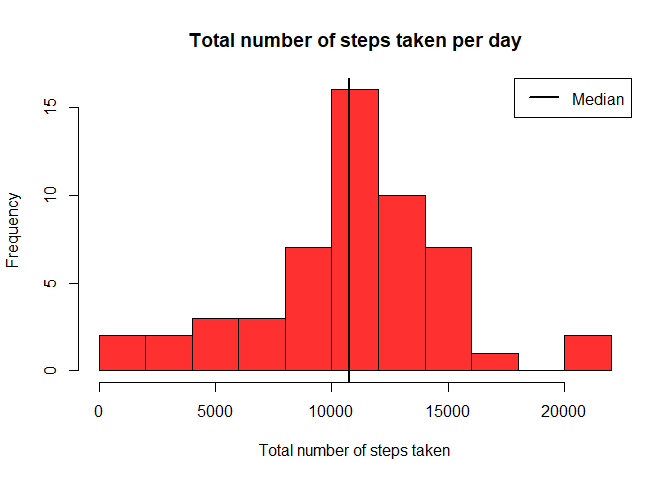
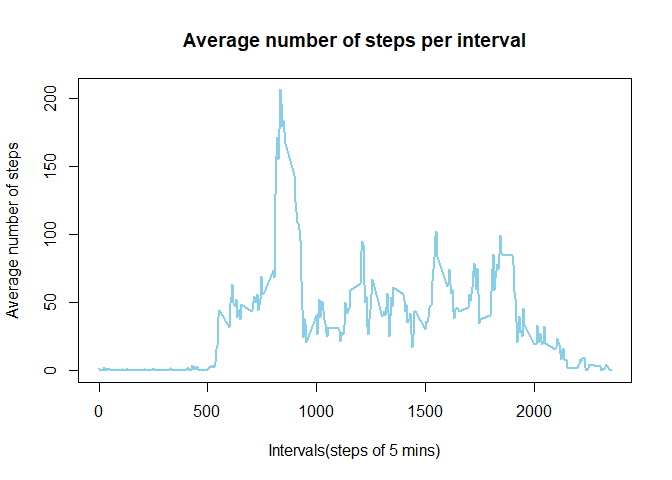
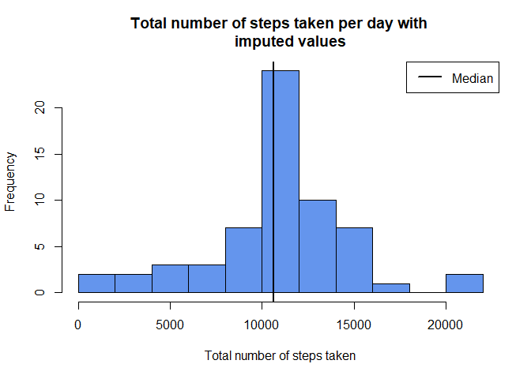
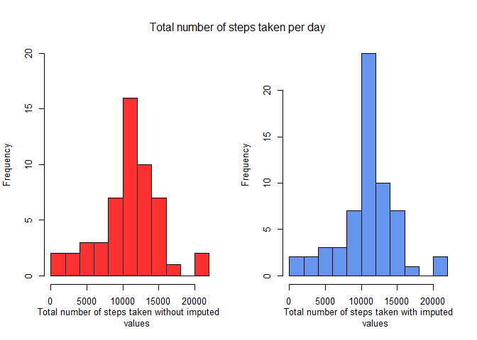
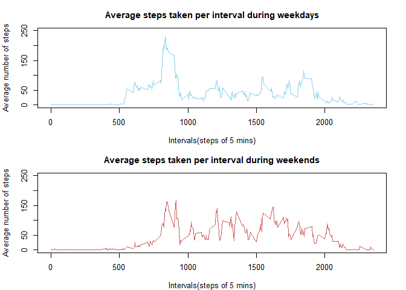

## Introduction

This analysis makes use of data from a personal activity monitoring device. This device collects data at 5 minute intervals through out the day. The data consists of two months of data from an anonymous individual collected during the months of October and November, 2012 and include the number of steps taken in 5 minute intervals each day.

### Data

- Dataset : [Activity Monitoring Data](https://d396qusza40orc.cloudfront.net/repdata%2Fdata%2Factivity.zip)

- The dataset is stored in a comma-separated-value (CSV) file and there are a total of 17,568           observations in this dataset.

- Variables in the dataset :
    - steps : Number of steps taking in a 5-minute interval (Missing values are coded as NA).

    - date : The date on which the measurement was taken in YYYY-MM-DD format.

    - interval : Identifier for the 5-minute interval in which measurement was taken


## Loading and preprocessing the data

This analysis assumes that all the work is done in a single working directory.
The file containing the dataset is downloaded using the download link from above. The file is
unzipped and data from the csv file is read into the data frame. The dataset is then converted 
from data frame to a tibble for much cleaner and better analysis. 


```r
library(dplyr)
```


```r
url <- "https://d396qusza40orc.cloudfront.net/repdata%2Fdata%2Factivity.zip"
destfile <- "activity.zip"
download.file(url, destfile)
unzip(destfile)
data <- tibble::as_tibble(read.csv("activity.csv"))
```

Here's a quick summary of the dataset.


```r
summary(data)
```

```
##      steps            date              interval     
##  Min.   :  0.00   Length:17568       Min.   :   0.0  
##  1st Qu.:  0.00   Class :character   1st Qu.: 588.8  
##  Median :  0.00   Mode  :character   Median :1177.5  
##  Mean   : 37.38                      Mean   :1177.5  
##  3rd Qu.: 12.00                      3rd Qu.:1766.2  
##  Max.   :806.00                      Max.   :2355.0  
##  NA's   :2304
```

The 'date' column in the dataset is of the class character. It is converted to the date class.


```r
data <- mutate(data, date = as.Date(date))
data
```

```
## # A tibble: 17,568 x 3
##    steps date       interval
##    <int> <date>        <int>
##  1    NA 2012-10-01        0
##  2    NA 2012-10-01        5
##  3    NA 2012-10-01       10
##  4    NA 2012-10-01       15
##  5    NA 2012-10-01       20
##  6    NA 2012-10-01       25
##  7    NA 2012-10-01       30
##  8    NA 2012-10-01       35
##  9    NA 2012-10-01       40
## 10    NA 2012-10-01       45
## # ... with 17,558 more rows
```

The original values of the dataset are stored in the table 'data'. Since it contains NA values in 
'steps' column observed in some days, a new table 'newdata' is created with the NA values removed.


```r
newdata <- na.omit(data)
newdata
```

```
## # A tibble: 15,264 x 3
##    steps date       interval
##    <int> <date>        <int>
##  1     0 2012-10-02        0
##  2     0 2012-10-02        5
##  3     0 2012-10-02       10
##  4     0 2012-10-02       15
##  5     0 2012-10-02       20
##  6     0 2012-10-02       25
##  7     0 2012-10-02       30
##  8     0 2012-10-02       35
##  9     0 2012-10-02       40
## 10     0 2012-10-02       45
## # ... with 15,254 more rows
```


## Mean total number of steps taken per day

For this analysis, data with NA values are ignored. We use the 'newdata' table.
To calculate the total number of steps per day, values of the 'steps' column has to be grouped
by each day of the month and then the sum of each group is calculated. The aggregate function is
used for this purpose. It first groups the 'steps' column by the values of 'date' column and then
applies the sum function to all the groups.


```r
stepsperday <- tibble::as_tibble(aggregate(steps ~ date, newdata, sum))
print.data.frame(head(stepsperday))
```

```
##         date steps
## 1 2012-10-02   126
## 2 2012-10-03 11352
## 3 2012-10-04 12116
## 4 2012-10-05 13294
## 5 2012-10-06 15420
## 6 2012-10-07 11015
```

A histogram is created to indicate the frequency of the total number of steps taken in each day. 
The line indicates the median of the values.


```r
hist(stepsperday$steps, breaks = 15, main = "Total number of steps taken per day", 
     xlab = "Total number of steps taken", col = "firebrick1")
abline(v = median(stepsperday$steps), lty = 1, lwd = 2, col = "black")
legend(x = "topright", "Median", col = "black", lty = 1, lwd = 2)
```

<!-- -->

Finally, the mean and median values of total number of steps per day is calculated.

```r
print.data.frame(summarise(stepsperday, mean_value = mean(steps), median_value = median(steps)))
```

```
##   mean_value median_value
## 1   10766.19        10765
```


## Average daily activity pattern

For this analysis, data with NA values are ignored. We use the 'newdata' table.
Daily activity pattern is analyzed by calculating the average number of steps taken at each interval.
To do so, values of the 'steps' column is grouped by each interval and mean of each group is 
calculated. The aggregate function is utilized again to achieve the purpose.


```r
stepsperinterval <- tibble::as_tibble(aggregate(steps ~ interval, newdata, mean))
print.data.frame(head(stepsperinterval))
```

```
##   interval     steps
## 1        0 1.7169811
## 2        5 0.3396226
## 3       10 0.1320755
## 4       15 0.1509434
## 5       20 0.0754717
## 6       25 2.0943396
```

A time series plot is created with each five minute interval on x-axis and average steps taken on 
y-axis.


```r
plot(stepsperinterval$interval, stepsperinterval$steps, type = "l", col = "sky blue",
     main = "Average number of steps per interval", xlab = "Intervals(steps of 5 mins)",
     ylab = "Average number of steps", lwd = 2)
```

<!-- -->

Finally, the interval that contains the maximum number of steps is calculated.


```r
print.data.frame(stepsperinterval[grep(max(stepsperinterval$steps), stepsperinterval$steps), ])
```

```
##   interval    steps
## 1      835 206.1698
```


## Imputing missing values

The original processed table 'data' contains NA values and from the given information on the
variables of the dataset, it is known that the 'steps' column contain NA values. Here is an
observation on number of rows containing NA values and the dates that contain those missing values.


```r
data.frame(steps = sum(is.na(data$steps)), date = sum(is.na(data$date)),
           interval = sum(is.na(data$interval)))
```

```
##   steps date interval
## 1  2304    0        0
```


```r
datawithNA <- data[(is.na(data$steps)), ]
unique(datawithNA$date)
```

```
## [1] "2012-10-01" "2012-10-08" "2012-11-01" "2012-11-04" "2012-11-09"
## [6] "2012-11-10" "2012-11-14" "2012-11-30"
```

The above output shows all the dates that contain missing values. The presence of missing values 
may introduce bias into some calculations or summaries of the data. For filling in all of the 
missing values of the dataset, values of the average daily activity pattern is used. The missing
values are substituted with the floor values of the mean of number of steps taken in each 
five minute interval.


```r
imputeddata <- as.data.frame(data)
for (i in 1 : nrow(imputeddata)) {
    if (is.na(imputeddata[i, 1])) {
        temp <- stepsperinterval[stepsperinterval$interval %in% imputeddata[i, 3], 2]
        imputeddata[i, 1] <- floor(temp)
    }
}
imputeddata <- tibble(imputeddata)
imputeddata$steps <- as.integer(imputeddata$steps)
imputeddata
```

```
## # A tibble: 17,568 x 3
##    steps date       interval
##    <int> <date>        <int>
##  1     1 2012-10-01        0
##  2     0 2012-10-01        5
##  3     0 2012-10-01       10
##  4     0 2012-10-01       15
##  5     0 2012-10-01       20
##  6     2 2012-10-01       25
##  7     0 2012-10-01       30
##  8     0 2012-10-01       35
##  9     0 2012-10-01       40
## 10     1 2012-10-01       45
## # ... with 17,558 more rows
```

Using the imputed data, a histogram is created to show the frequency of total number of steps taken
in a day. The procedure of grouping the 'steps' column by the 'data' column is repeated but with
the new imputed data.


```r
imputedstepsperday <- tibble::as_tibble(aggregate(steps ~ date, imputeddata, sum))
print.data.frame(head(imputedstepsperday))
```

```
##         date steps
## 1 2012-10-01 10641
## 2 2012-10-02   126
## 3 2012-10-03 11352
## 4 2012-10-04 12116
## 5 2012-10-05 13294
## 6 2012-10-06 15420
```


```r
hist(imputedstepsperday$steps, breaks = 15, main = "Total number of steps taken per day with 
     imputed values", xlab = "Total number of steps taken", col = "cornflowerblue")
abline(v = median(imputedstepsperday$steps), lty = 1, lwd = 2, col = "black")
legend(x = "topright", "Median", col = "black", lty = 1, lwd = 2)
```

<!-- -->

The mean and median values of total number of steps per day with the imputed values is calculated.


```r
print.data.frame(summarise(imputedstepsperday, mean_value = mean(steps), 
                           median_value = median(steps)))
```

```
##   mean_value median_value
## 1   10749.77        10641
```

Finally, the results obtained from both the imputed data and non-imputed data is compared.
The values of mean and median, and histogram plots are used for comparison.


```r
comparedata <- rbind(summarise(stepsperday, mean_value = mean(steps), 
                               median_value = median(steps)),
                     summarise(imputedstepsperday, mean_value = mean(steps), 
                               median_value = median(steps)))
rownames(comparedata) <- c("non-imputed data", "imputed data")
print.data.frame(comparedata)
```

```
##                  mean_value median_value
## non-imputed data   10766.19        10765
## imputed data       10749.77        10641
```


```r
par(mfrow = c(1, 2), cex = 0.8)
hist(stepsperday$steps, breaks = 15, xlab = "Total number of steps taken without imputed 
     values", col = "firebrick1", main = NULL, ylim = c(0, 20))
hist(imputedstepsperday$steps, breaks = 15, xlab = "Total number of steps taken with imputed
     values", col = "cornflowerblue", main = NULL)

mtext("Total number of steps taken per day", side = 3, line = -3, outer = T)
```

<!-- -->

From the observation, it can be concluded that the mean and median values of the imputed and 
non-imputed values are comparable with the values of the imputed data being slightly lesser, which
is expected as filling in the missing values decreased the mean value rather than the higher mean 
value of the non-imputed data. In the plots, the frequency of the second histogram is quite larger 
than the first, indicating that the imputed values increased the mean number of steps taken on a
daily basis.


## Differences in activity patterns between weekdays and weekends

For this analysis, the data with the imputed values is used. To the same data, a new factor 
variable is introduced called 'typeofday'. Based on the value of the 'date' column, the 'typeofday'
column either has 'weekday' or 'weekend' as its value. This is achieved with the help of weekdays
function. Note that for comparison, a new character vector is created containing the values
"Saturday" and "Sunday". If the value of the weekdays function matches any values in the character
vector, the factor takes the value 'weekend', otherwise it takes 'weekday' as its value.


```r
daysdata <- imputeddata
weekends <- c("Saturday", "Sunday")
daysdata$typeofday <- factor(weekdays(daysdata$date) %in% weekends, levels = c(FALSE, TRUE),
                             labels = c("Weekday", "Weekend"))
daysdata
```

```
## # A tibble: 17,568 x 4
##    steps date       interval typeofday
##    <int> <date>        <int> <fct>    
##  1     1 2012-10-01        0 Weekday  
##  2     0 2012-10-01        5 Weekday  
##  3     0 2012-10-01       10 Weekday  
##  4     0 2012-10-01       15 Weekday  
##  5     0 2012-10-01       20 Weekday  
##  6     2 2012-10-01       25 Weekday  
##  7     0 2012-10-01       30 Weekday  
##  8     0 2012-10-01       35 Weekday  
##  9     0 2012-10-01       40 Weekday  
## 10     1 2012-10-01       45 Weekday  
## # ... with 17,558 more rows
```

For analyzing the differences in activity patterns between weekdays and weekends, the 'daysdata'
has to be partitioned into sets of data, one containing the data from weekdays and the other
containing from the data from weekends. Using these sets of data, mean number of steps taken per
interval is calculated. This procedure is similar to the one done in average daily patterns where
'steps' column is grouped by the 'interval' column using aggregate function.


```r
meanweekday <- aggregate(steps ~ interval, daysdata[daysdata$typeofday == "Weekday", ], mean)
meanweekend <- aggregate(steps ~ interval, daysdata[daysdata$typeofday == "Weekend", ], mean)
print.data.frame(head(meanweekday))
```

```
##   interval      steps
## 1        0 2.15555556
## 2        5 0.40000000
## 3       10 0.15555556
## 4       15 0.17777778
## 5       20 0.08888889
## 6       25 1.57777778
```

```r
print.data.frame(head(meanweekend))
```

```
##   interval steps
## 1        0 0.125
## 2        5 0.000
## 3       10 0.000
## 4       15 0.000
## 5       20 0.000
## 6       25 3.500
```

Finally, two time series plots are created, one referencing the weekdays data and the other 
referencing the weekends data.


```r
par(mfrow = c(2, 1), mar = c(4, 4.1, 3, 2.1), cex = 0.80)
plot(meanweekday$interval, meanweekday$steps, type = "l", col = "sky blue", ylim = c(0, 250),
     main = "Average steps taken per interval during weekdays", xlab = "Intervals(steps of 5 mins)",
     ylab = "Average number of steps", lwd = 1.5)
plot(meanweekend$interval, meanweekend$steps, type = "l", col = "indianred", ylim = c(0, 250),
     main = "Average steps taken per interval during weekends", xlab = "Intervals(steps of 5 mins)",
     ylab = "Average number of steps", lwd = 1.5)
```

<!-- -->

from the observations, it can be concluded that though the number of steps taken peaks during the
weekdays, number of steps taken are more during the weekends.
